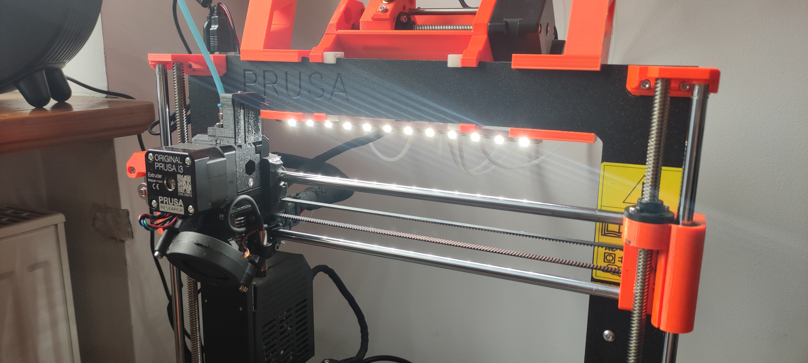
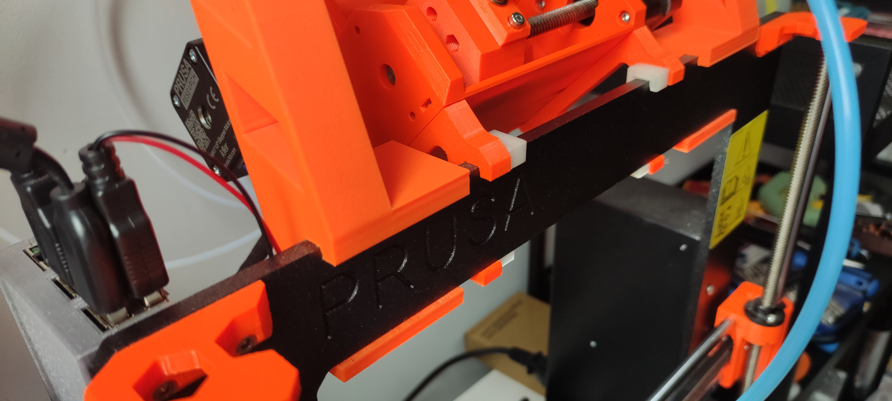

# Prusa i3 LED strip mount
A LED strip mount compatible with MMU and an [alternative spool holder](https://www.printables.com/model/2888-spool-holder-for-mmu2s).
Allows for any spacing between the mounting posts on the frame, since the
entire part holding the LED strip is a mounting point.

| Front | Left |
|:-----:|:----:|
|  |  |

## Build manual

### Quick build
Head on over to [printables.com](https://www.printables.com/model/324910-mmu-compatible-led-strip-mount). The model there supports a 20 cm long, 10 mm wide LED strip,
fastened with 2 x M2 bolts & nuts.

0. Print 2 frame mounts and 1 strip mount.
1. Insert the hex nuts into the 2 frame mounts.
2. Attach the frame mounts to your printer frame.
3. Mount the strip mount to the frame mounts.
4. Glue the LED strip to the strip mount.

### Customizing
You can customize this build to fit any length or width of a LED strip you have
laying around, as well as pick your own fastener. Open `parameters.scad` in
OpenSCAD, edit, then render the frame and strip mounts.
